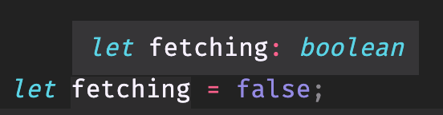
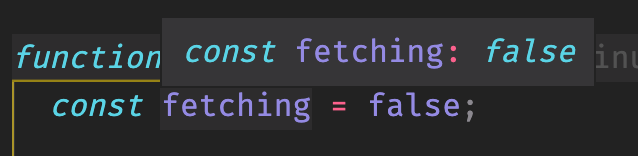

# Starting a new project in Typescript - the config and syntax

`npx create-react-app my-app --template typescript`

## What is different in `--template typescript`

- `tsconfig.json`

  - Most of the config you don't need to worry about which is why we rely on tools like create-react-app to handle the boilerplate for us.
  - Config to care about:
    1. `"strict": true`
    2. `"include": ["src"]`

- A few more dependencies in our `package.json`

  ```json
  "@testing-library/jest-dom": "^4.2.4",
  "@testing-library/react": "^9.3.2",
  "@testing-library/user-event": "^7.1.2",
  "@types/jest": "^24.0.0",
  "@types/node": "^12.0.0",
  "@types/react": "^16.9.0",
  "@types/react-dom": "^16.9.0",
  ```

- `.tsx` file extensions

  - Files that include JSX must have a .tsx extension.

- Everything else is virtually identical to a JS create-react-app project.

## Annotating our code with types

There is nothing special about the types in Typescript. You're working with the exact same primitive values that you have in Javascript. The only difference is you're explicitly declaring the types you're expecting through your code.

```ts
// Basics
const stringVar: string = "this is a string";
const numberVar: number = 1995;
const booleanVar: boolean = true;

// Array of anything
const arrayVar: any[] = [numberVar, stringVar, booleanVar];

// Array of strings
const stringArr: string[] = [stringVar, "another string"];

// Object with unspecified properties - can contain anything
const objectVar: {} = {
  name: "Braedon",
  age: 25,
  lovesIceCream: true,
};

// Object where we specify the structure
const objectWithTypes: {
  name: string;
  age: number;
  lovesIceCream?: boolean;
} = {
  name: "Braedon",
  age: 25,
};

// Other types
let voidFunction: () => void;
let nullVar: null;
let undefinedVar: undefined;
let anyVar: any;
let neverVar: never;
```

Typescript is smart enough to infer most types for us:



It's even smart enough to know when you're using let or const. We can see when we change the declaration from `let` to `const`, Typescript will infer this to always be `false` instead of boolean since we can no longer re-assign the variable:


